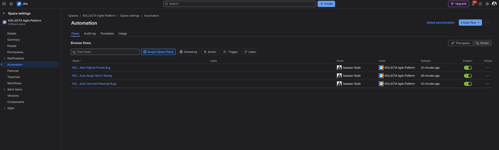
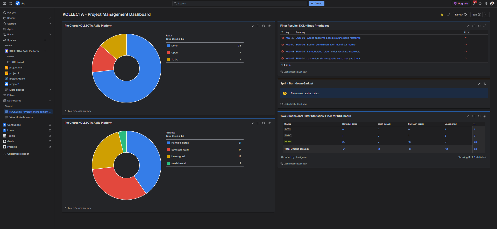

# 🚀 KOLLECTA Agile Platform — Case Study Jira Cloud & Atlassian Administration


## 📌 Executive Summary
**KOLLECTA** est une plateforme SaaS de financement participatif et de dons. Ce dépôt documente l'implémentation complète du cadre **Scrum**, le paramétrage avancé de **Jira Software Cloud**, l'automatisation des flux métiers et la gouvernance d'administration Atlassian.

---

## 🛠️ 1. Architecture Administration & Gouvernance (Atlassian Admin)

### **Gouvernance des Accès (Stratégie Free Plan)**
Pour contourner la gestion restreinte des rôle-projets sur le plan gratuit Jira Cloud sans compromettre la sécurité, l'habilitation repose sur des **Groupes d'Organisation Globaux** (`Directory > Groups`) :
* `KOLLECTA-Developers` : Développeurs (2 membres).
* `KOLLECTA-Product-Owner` : Product Owner (1 membre).
* `KOLLECTA-QA` : Équipe Qualité / Recette (1 membre).
* `KOLLECTA-Scrum-Master` : Animation et métriques Agiles (1 membre).


### **Découpage par Composants (Components)**
Mise en place de 9 composants fonctionnels et techniques pour structurer le Backlog et le suivi des releases :
* `Security`, `Authentication`, `Database`, `Backend`, `Frontend`, `Donations`, `Crowdfunding`, `Notifications`, `DevOps`.
* Configuration du `Default Assignee` en `Project Default` pour garantir la maintenabilité.


---

## 🔄 2. Exécution Agilité & Framework Scrum

* **Sprints :** 4 Sprints de 2 semaines réalisés avec succès (100% des engagements honorés).
* **Work Items :** 52 tickets gérés au total (Epics, Stories, Tasks d'infrastructure, Bugs).
* **Quality Gate :** Workflow intégrant une étape `Testing` obligatoire sous la responsabilité de la QA (`Sarah Ben Ali`).


---

## 🤖 3. Automatisation & Ingénierie JQL

### **Règles Jira Automation Actives**
1. **`KOL - Auto Comment Resolved Bugs`** : Injection automatique d'un commentaire d'audit lors du passage d'un Bug à `Done`.
2. **`KOL - Auto Assign QA on Testing`** : Assignation automatique à la QA dès qu'un ticket passe en `Testing`.
3. **`KOL - Alert Highest Priority Bug`** : Notification prioritaire instantanée sur création d'un Bug de priorité `Highest`.



### **Filtres JQL Optimisés**
* **Bugs Prioritaires :** `project = "KOL" AND type = Bug AND priority IN (High, Highest)`
* **Charge Dev Lead :** `project = "KOL" AND assignee = "hannibal.bar"`
* **Recette QA :** `project = "KOL" AND status = "Testing"`
* **Tickets Clôturés :** `project = "KOL" AND status = Done`
* **Future Backlog :** `project = "KOL" AND (assignee IS EMPTY OR sprint IS EMPTY) AND status != Done`

---

## 📊 4. Reporting & Decision-Making Dashboard

Le tableau de bord exécutif **`KOLLECTA - Project Management Dashboard`** permet un pilotage en temps réel :
* **Pie Charts :** Répartition globale par Statut et par Assignee.
* **Filter Results :** Suivi direct des bugs prioritaires non résolus.
* **Two Dimensional Filter Statistics :** Matrice croisée `Assignee x Status` mesurant l'état d'avancement de chaque membre.



---

## 📂 Structure du Dépôt

```text
KOLLECTA-Agile-Platform/
├── docs/
│   └── screenshots/          # Captures d'écran des preuves d'implémentation Jira
└── README.md                 # Fichier de présentation du Case Study