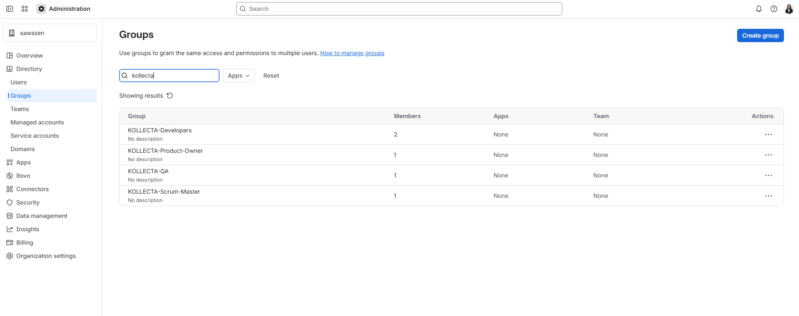
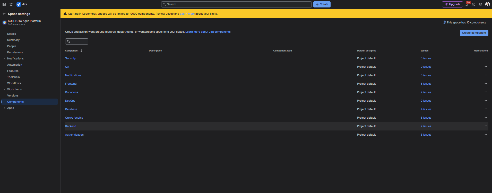

# 🛠️ 1. Architecture Administration & Gouvernance (Atlassian Admin)

## 🔐 Gouvernance des Accès (Stratégie Free Plan)
Pour contourner la gestion restreinte des rôles-projets sur le plan gratuit Jira Cloud sans compromettre la sécurité, l'habilitation repose sur des **Groupes d'Organisation Globaux** (`Directory > Groups`) :
* **`KOLLECTA-Developers`** : Développeurs (2 membres).
* **`KOLLECTA-Product-Owner`** : Product Owner (1 membre).
* **`KOLLECTA-QA`** : Équipe Qualité / Recette (1 membre).
* **`KOLLECTA-Scrum-Master`** : Animation et métriques Agiles (1 membre).

---

## 🧩 Découpage par Composants (Components)
Mise en place de 9 composants fonctionnels et techniques pour structurer le Backlog et le suivi des releases :
* `Security`, `Authentication`, `Database`, `Backend`, `Frontend`, `Donations`, `Crowdfunding`, `Notifications`, `DevOps`.
* Configuration du `Default Assignee` en `Project Default` pour garantir la maintenabilité.

