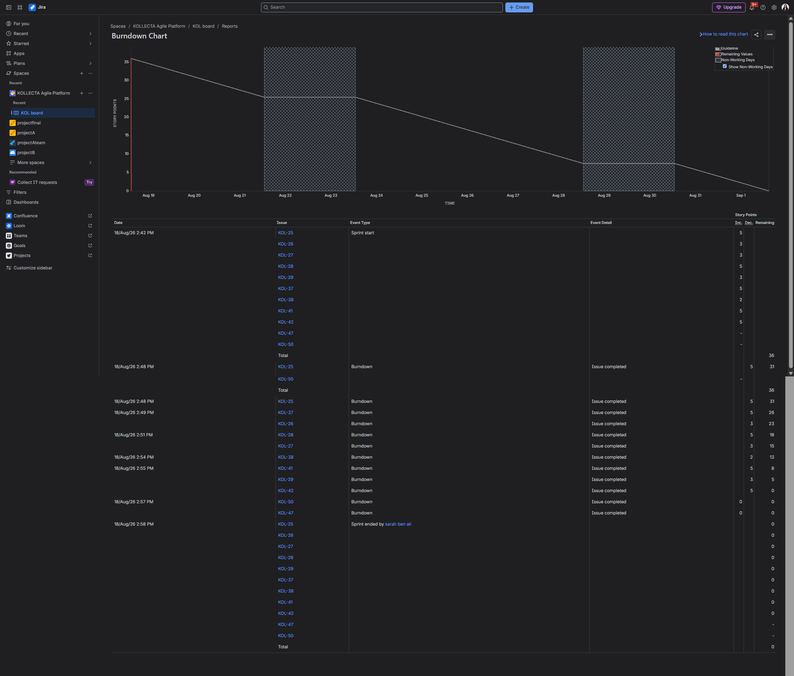

# 🔄 2. Exécution Agilité & Framework Scrum

## 🎯 Cadre Méthodologique
L'équipe utilise le cadre Scrum appliqué à la plateforme SaaS **KOLLECTA** :

* **Sprints :** 4 Sprints de 2 semaines réalisés avec succès (100% des engagements honorés).
* **Work Items :** 52 tickets gérés au total (Epics, Stories, Tasks d'infrastructure, Bugs).
* **Quality Gate :** Workflow intégrant une étape `Testing` obligatoire sous la responsabilité de la QA (`Sarah Ben Ali`).

---

## 📊 Suivi d'Avancement (Burndown Chart)

